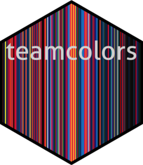
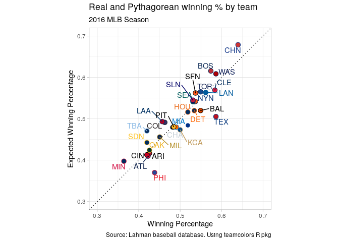
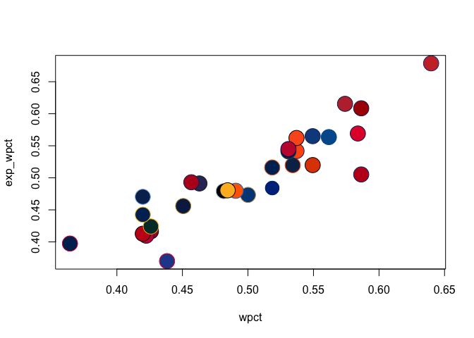
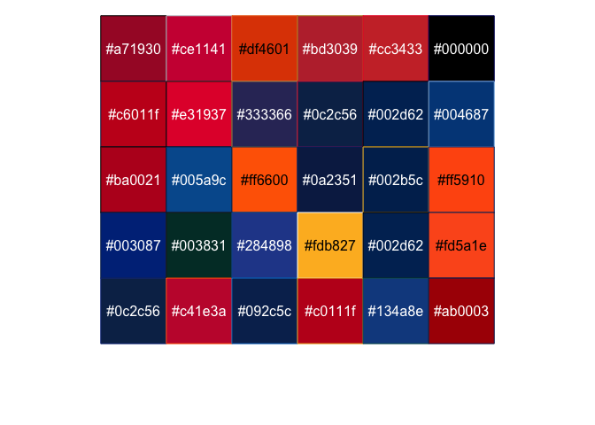
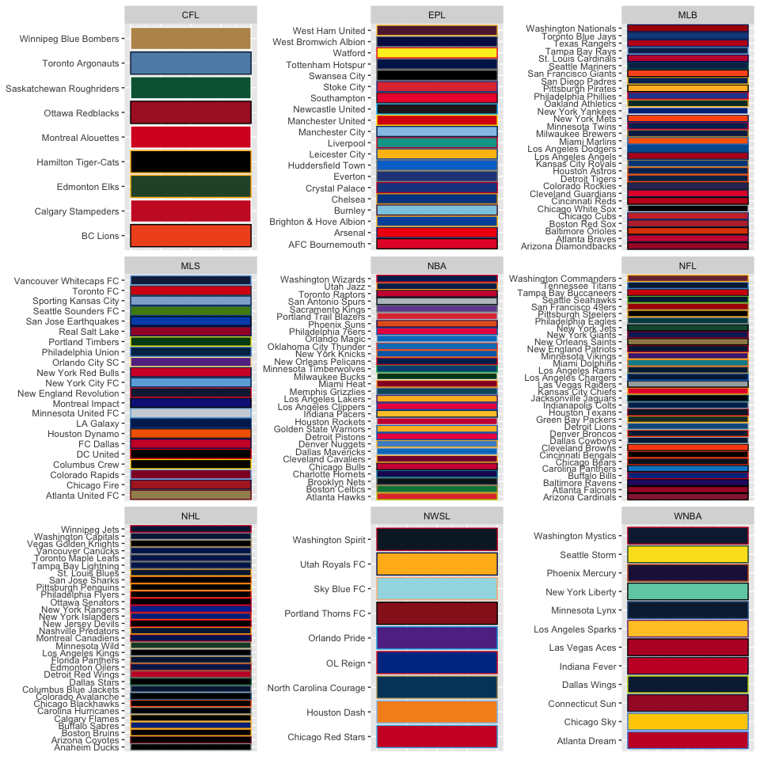
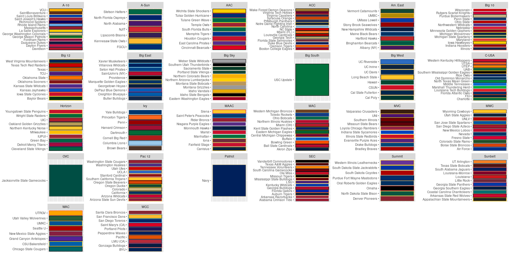

# teamcolors 

<!-- badges: start -->

[](https://travis-ci.org/beanumber/teamcolors)
[](https://cran.r-project.org/package=teamcolors)
<!-- badges: end -->

An R package providing color palettes for pro and amateur sports teams.
The palettes are provided by [Jim Neilsen’s Team Colors
website](http://jim-nielsen.com/teamcolors/) and offered with only
minimal alterations. NCAA colors come from
[teamcolorcodes.com](https://teamcolorcodes.com/), via the
[ncaahoopR](https://github.com/lbenz730/ncaahoopR) package.

## Install

To install the CRAN version, use:

``` r
install.packages(teamcolors)
```

To install the development version from GitHub, use:

``` r
devtools::install_github("beanumber/teamcolors")
```

## Load

``` r
library(teamcolors)
head(teamcolors)
```

    ## # A tibble: 6 x 11
    ##   name  league primary secondary tertiary quaternary division location
    ##   <chr> <chr>  <chr>   <chr>     <chr>    <chr>      <chr>    <chr>   
    ## 1 AFC … epl    #e62333 #000000   <NA>     <NA>       <NA>     AFC     
    ## 2 Air … ncaa   #003087 #8A8D8F   #B1B3B3  #FFC72C    MWC      Air For…
    ## 3 Akro… ncaa   #041E42 #A89968   <NA>     <NA>       MAC      Akron   
    ## 4 Alab… ncaa   #9E1B32 #828A8F   #FFFFFF  <NA>       SEC      Alabama 
    ## 5 Alba… ncaa   #461660 #EEB211   <NA>     <NA>       Am. East Albany  
    ## 6 Anah… nhl    #010101 #a2aaad   #fc4c02  #85714d    Pacific  Anaheim 
    ## # … with 3 more variables: mascot <chr>, sportslogos_name <chr>,
    ## #   logo <chr>

## Show palettes

Sometimes you need to work with a named vector of colors. Other times
you can use the built-in `scale_color_teams()` and `scale_color_fill()`
functions.

``` r
league_pal("nba")
```

    ##          Atlanta Hawks         Boston Celtics          Brooklyn Nets 
    ##              "#e13a3e"              "#008348"              "#061922" 
    ##      Charlotte Hornets          Chicago Bulls    Cleveland Cavaliers 
    ##              "#1d1160"              "#ce1141"              "#860038" 
    ##       Dallas Mavericks         Denver Nuggets        Detroit Pistons 
    ##              "#007dc5"              "#4d90cd"              "#ed174c" 
    ##  Golden State Warriors        Houston Rockets         Indiana Pacers 
    ##              "#fdb927"              "#ce1141"              "#ffc633" 
    ##   Los Angeles Clippers     Los Angeles Lakers      Memphis Grizzlies 
    ##              "#ed174c"              "#fdb927"              "#0f586c" 
    ##             Miami Heat        Milwaukee Bucks Minnesota Timberwolves 
    ##              "#98002e"              "#00471b"              "#005083" 
    ##   New Orleans Pelicans        New York Knicks  Oklahoma City Thunder 
    ##              "#002b5c"              "#006bb6"              "#007dc3" 
    ##          Orlando Magic     Philadelphia 76ers           Phoenix Suns 
    ##              "#007dc5"              "#ed174c"              "#e56020" 
    ## Portland Trail Blazers       Sacramento Kings      San Antonio Spurs 
    ##              "#e03a3e"              "#724c9f"              "#bac3c9" 
    ##        Toronto Raptors              Utah Jazz     Washington Wizards 
    ##              "#ce1141"              "#002b5c"              "#002b5c"

## Plot

In baseball, [Pythagorean
expectation](https://en.wikipedia.org/wiki/Pythagorean_expectation)
relates expected winning percentage to runs allowed and runs scored. How
well does it work?

``` r
library(Lahman)
library(tidyverse)
pythag <- Teams %>%
  filter(yearID == 2016) %>%
  select(name, teamID, yearID, W, L, R, RA) %>%
  mutate(wpct = W / (W + L), exp_wpct = 1 / (1 + (RA/R)^2),
         # note name discrepancy!
         name = ifelse(name == "Los Angeles Angels of Anaheim", "Los Angeles Angels", name))
```

### `ggplot2`

``` r
ggplot(pythag, aes(x = wpct, y = exp_wpct, color = name, fill = name)) + 
  geom_abline(slope = 1, intercept = 0, linetype = 3) + 
  geom_point(shape = 21, size = 3) + 
  scale_fill_teams(guide = FALSE) + 
  scale_color_teams(2, guide = FALSE) + 
  ggrepel::geom_text_repel(aes(label = teamID)) + 
  scale_x_continuous("Winning Percentage", limits = c(0.3, 0.7)) + 
  scale_y_continuous("Expected Winning Percentage", limits = c(0.3, 0.7)) + 
  theme_light() +
  labs(title = "Real and Pythagorean winning % by team",
       subtitle = paste(first(pull(pythag, yearID)), "MLB Season", sep = " "),
       caption = "Source: Lahman baseball database. Using teamcolors R pkg") +
  coord_equal()
```

<!-- -->

### Base R

``` r
pythag <- pythag %>%
  left_join(teamcolors, by = "name")
with(pythag, plot(wpct, exp_wpct, bg = primary, col = secondary, pch = 21, cex = 3))
```

<!-- -->

## Key

You can see the color palettes using existing functionality from the
[scales](https://github.com/r-lib/scales) package, but it won’t show the
names of the teams.

``` r
scales::show_col(league_pal("mlb"), borders = league_pal("mlb", 2))
```

<!-- -->

So, instead, use `show_team_col()`. Note that this only shows color
palettes for non-NCAA teams.

``` r
show_team_col()
```

<!-- -->

To view color palettes for college teams, use the `show_ncaa_col()`
function \[1\].

``` r
show_ncaa_col()
```

<!-- -->

## Logos

Links to team logos are provided by (<http://www.sportslogos.net/>).

``` r
teamcolors %>%
  filter(grepl("New ", name)) %>% 
  pull(logo) %>%
  knitr::include_graphics()
```

<!-- --><!-- --><!-- --><!-- --><!-- --><!-- --><!-- --><!-- --><!-- --><!-- --><!-- --><!-- --><!-- --><!-- --><!-- --><!-- --><!-- --><!-- -->

Note that we don’t have any coverage for the EPL.

``` r
teamcolors %>%
  group_by(league) %>%
  summarize(num_teams = n(), 
            num_logos = sum(!is.na(logo)))
```

    ## # A tibble: 9 x 3
    ##   league num_teams num_logos
    ##   <chr>      <int>     <int>
    ## 1 epl           20         0
    ## 2 mlb           30        30
    ## 3 mls           22        22
    ## 4 nba           30        30
    ## 5 ncaa         248       248
    ## 6 nfl           32        32
    ## 7 nhl           31        31
    ## 8 nwsl           9         9
    ## 9 wnba          12        12

## References

For more examples see:

  - Lopez, M.J., Matthews, G.J., Baumer, B.S., “How often does the best
    team win? A unified approach to understanding randomness in North
    American sport,” *The Annals of Applied Statistics*, vol. 12, no. 4,
    2018, pp. 2483–2516. URL
    (<https://projecteuclid.org/euclid.aoas/1542078053>)

To cite this package in your work, see:

``` r
citation("teamcolors")
```

## Notes

1.  Note that hexcodes are only available for 248 of 353 Division I
    teams.
