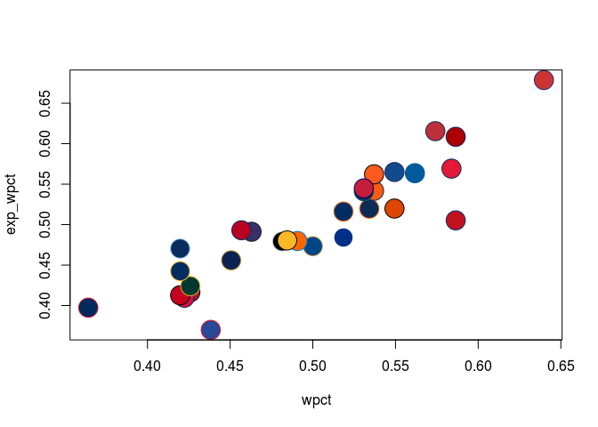
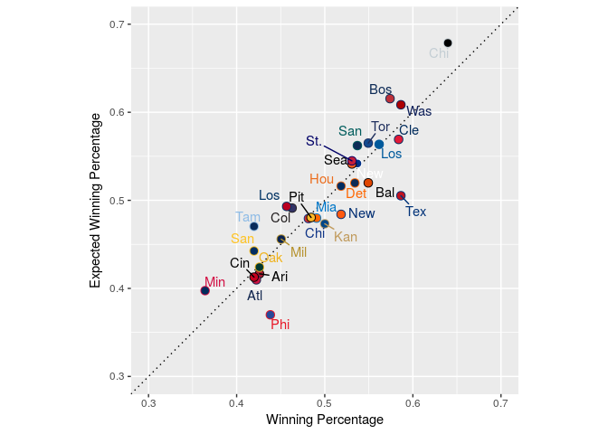

teamcolors
================

[](https://travis-ci.org/beanumber/teamcolors)

An R package providing color palettes for pro sports teams. The palattes are provided by [Jim Neilsen's Team Colors website](http://jim-nielsen.com/teamcolors/).

Install
-------

``` r
devtools::install_github("beanumber/teamcolors")
```

Load
----

``` r
library(teamcolors)
head(teamcolors)
```

    ##                   name league primary secondary tertiary quaternary
    ## 1      AFC Bournemouth    epl #e62333   #000000     <NA>       <NA>
    ## 2        Anaheim Ducks    nhl #010101   #a2aaad  #fc4c02    #85714d
    ## 3    Arizona Cardinals    nfl #97233f   #000000  #ffb612    #a5acaf
    ## 4      Arizona Coyotes    nhl #010101   #862633  #ddcba4       <NA>
    ## 5 Arizona Diamondbacks    mlb #a71930   #000000  #e3d4ad       <NA>
    ## 6              Arsenal    epl #ef0107   #023474  #9c824a       <NA>

Plot
----

``` r
library(Lahman)
library(tidyverse)
pythag <- Teams %>%
  filter(yearID == 2016) %>%
  select(name, W, L, R, RA) %>%
  mutate(wpct = W / (W + L), exp_wpct = 1 / (1 + (RA/R)^2)) %>%
  left_join(teamcolors, by = "name")
with(pythag, plot(wpct, exp_wpct, bg = primary, col = secondary, pch = 21, cex = 3))
```



``` r
ggplot(pythag, aes(x = wpct, y = exp_wpct, color = name, fill = name)) + 
  geom_abline(slope = 1, intercept = 0, linetype = 3) + 
  geom_point(shape = 21, size = 3) + 
  scale_fill_manual(values = pythag$primary, guide = FALSE) + 
  scale_color_manual(values = pythag$secondary, guide = FALSE) + 
  ggrepel::geom_text_repel(aes(label = substr(name, 1, 3))) + 
  scale_x_continuous("Winning Percentage", limits = c(0.3, 0.7)) + 
  scale_y_continuous("Expected Winning Percentage", limits = c(0.3, 0.7)) + 
  coord_equal()
```



References
----------

For more examples see:

-   Lopez, M.J., Matthews, G.J., Baumer, B.S., "How often does the best team win? A unified approach to understanding randomness in North American sport", (<https://arxiv.org/abs/1701.05976>)
