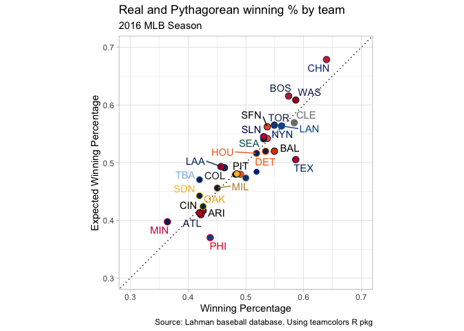
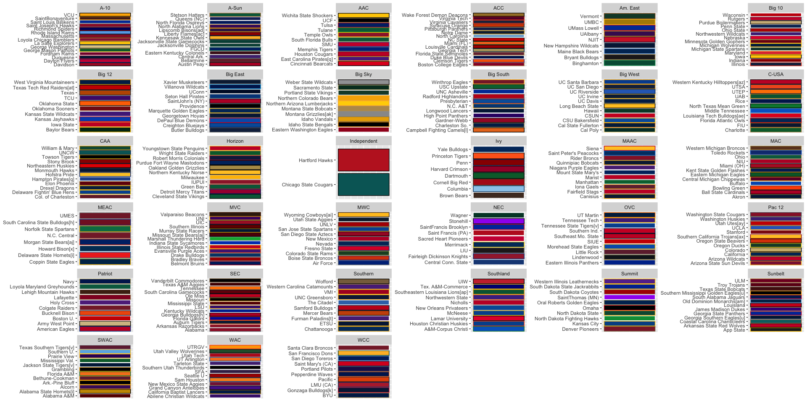

# teamcolors 

<!-- badges: start -->

[](https://github.com/beanumber/teamcolors/actions/workflows/R-CMD-check.yaml)
[](https://cran.r-project.org/package=teamcolors)
<!-- badges: end -->

An R package providing color palettes for pro and amateur sports teams.
The palettes are provided by [Jim Neilsen’s Team Colors
website](http://jim-nielsen.com/teamcolors/) and offered with only
minimal alterations. NCAA colors come from
[teamcolorcodes.com](https://teamcolorcodes.com/), via the
[ncaahoopR](https://github.com/lbenz730/ncaahoopR) package. Other sports
include the [Women’s National Basketball Association](https://wnba.com),
[National Women’s Soccer League](https://nwsl.com), and the [Canadian
Football League](https://cfl.com).

## Install

To install the CRAN version, use:

``` r
install.packages(teamcolors)
```

To install the development version from GitHub, use:

``` r
devtools::install_github("beanumber/teamcolors")
```

## Load

``` r
library(teamcolors)
head(teamcolors)
```

    ## # A tibble: 6 × 11
    ##   name     league primary secondary tertiary quaternary division location mascot
    ##   <chr>    <chr>  <chr>   <chr>     <chr>    <chr>      <chr>    <chr>    <chr> 
    ## 1 A&M-Cor… ncaa   #0067C5 #007F3E   <NA>     <NA>       Southla… A&M-Cor… Chris…
    ## 2 AFC Bou… epl    #e62333 #000000   <NA>     <NA>       <NA>     AFC      Bourn…
    ## 3 Abilene… ncaa   #461D7C #FFFFFF   <NA>     <NA>       WAC      Abilene  Chris…
    ## 4 Air For… ncaa   #003087 #8A8D8F   #B1B3B3  #FFC72C    MWC      Air For… <NA>  
    ## 5 Akron    ncaa   #041E42 #A89968   <NA>     <NA>       MAC      Akron    <NA>  
    ## 6 Alabama  ncaa   #9E1B32 #828A8F   #FFFFFF  <NA>       SEC      Alabama  <NA>  
    ## # ℹ 2 more variables: sportslogos_name <chr>, logo <chr>

## Show palettes

Sometimes you need to work with a named vector of colors. Other times
you can use the built-in `scale_color_teams()` and `scale_color_fill()`
functions.

``` r
league_pal("nba")
```

    ##          Atlanta Hawks         Boston Celtics          Brooklyn Nets 
    ##              "#e13a3e"              "#008348"              "#061922" 
    ##      Charlotte Hornets          Chicago Bulls    Cleveland Cavaliers 
    ##              "#1d1160"              "#ce1141"              "#860038" 
    ##       Dallas Mavericks         Denver Nuggets        Detroit Pistons 
    ##              "#007dc5"              "#4d90cd"              "#ed174c" 
    ##  Golden State Warriors        Houston Rockets         Indiana Pacers 
    ##              "#fdb927"              "#ce1141"              "#ffc633" 
    ##   Los Angeles Clippers     Los Angeles Lakers      Memphis Grizzlies 
    ##              "#ed174c"              "#fdb927"              "#0f586c" 
    ##             Miami Heat        Milwaukee Bucks Minnesota Timberwolves 
    ##              "#98002e"              "#00471b"              "#005083" 
    ##   New Orleans Pelicans        New York Knicks  Oklahoma City Thunder 
    ##              "#002b5c"              "#006bb6"              "#007dc3" 
    ##          Orlando Magic     Philadelphia 76ers           Phoenix Suns 
    ##              "#007dc5"              "#ed174c"              "#e56020" 
    ## Portland Trail Blazers       Sacramento Kings      San Antonio Spurs 
    ##              "#e03a3e"              "#724c9f"              "#bac3c9" 
    ##        Toronto Raptors              Utah Jazz     Washington Wizards 
    ##              "#ce1141"              "#002b5c"              "#002b5c"

## Plot

In baseball, [Pythagorean
expectation](https://en.wikipedia.org/wiki/Pythagorean_expectation)
relates expected winning percentage to runs allowed and runs scored. How
well does it work?

``` r
library(Lahman)
library(tidyverse)
pythag <- Teams %>%
  filter(yearID == 2016) %>%
  select(name, teamID, yearID, W, L, R, RA) %>%
  mutate(
    wpct = W / (W + L), exp_wpct = 1 / (1 + (RA / R)^2),
    # note name discrepancy!
    name = ifelse(name == "Los Angeles Angels of Anaheim", "Los Angeles Angels", name)
  )
```

### `ggplot2`

``` r
ggplot(pythag, aes(x = wpct, y = exp_wpct, color = name, fill = name)) +
  geom_abline(slope = 1, intercept = 0, linetype = 3) +
  geom_point(shape = 21, size = 3) +
  scale_fill_teams(guide = FALSE) +
  scale_color_teams(2, guide = FALSE) +
  ggrepel::geom_text_repel(aes(label = teamID)) +
  scale_x_continuous("Winning Percentage", limits = c(0.3, 0.7)) +
  scale_y_continuous("Expected Winning Percentage", limits = c(0.3, 0.7)) +
  theme_light() +
  labs(
    title = "Real and Pythagorean winning % by team",
    subtitle = paste(first(pull(pythag, yearID)), "MLB Season", sep = " "),
    caption = "Source: Lahman baseball database. Using teamcolors R pkg"
  ) +
  coord_equal()
```

    ## Warning: The `guide` argument in `scale_*()` cannot be `FALSE`. This was deprecated in
    ## ggplot2 3.3.4.
    ## ℹ Please use "none" instead.
    ## This warning is displayed once every 8 hours.
    ## Call `lifecycle::last_lifecycle_warnings()` to see where this warning was
    ## generated.

    ## Warning: ggrepel: 3 unlabeled data points (too many overlaps). Consider
    ## increasing max.overlaps

<!-- -->

### Base R

``` r
pythag <- pythag %>%
  left_join(teamcolors, by = "name")
with(pythag, plot(wpct, exp_wpct, bg = primary, col = secondary, pch = 21, cex = 3))
```

<!-- -->

## Key

You can see the color palettes using existing functionality from the
[scales](https://github.com/r-lib/scales) package, but it won’t show the
names of the teams.

``` r
scales::show_col(league_pal("mlb"), borders = league_pal("mlb", 2))
```

<!-- -->

So, instead, use `show_team_col()`. Note that this only shows color
palettes for non-NCAA teams.

``` r
show_team_col()
```

    ## Warning: The `<scale>` argument of `guides()` cannot be `FALSE`. Use "none" instead as
    ## of ggplot2 3.3.4.
    ## ℹ The deprecated feature was likely used in the teamcolors package.
    ##   Please report the issue at <https://github.com/beanumber/teamcolors/issues>.
    ## This warning is displayed once every 8 hours.
    ## Call `lifecycle::last_lifecycle_warnings()` to see where this warning was
    ## generated.

<!-- -->

To view color palettes for college teams, use the `show_ncaa_col()`
function.

``` r
show_ncaa_col()
```

<!-- -->

## Logos

Links to team logos are provided by (<http://www.sportslogos.net/>).

``` r
teamcolors %>%
  filter(grepl("New Y", name)) %>%
  pull(logo) %>%
  knitr::include_graphics()
```

<!-- --><!-- --><!-- --><!-- --><!-- --><!-- --><!-- --><!-- --><!-- --><!-- -->

Note that we don’t have any coverage for the EPL.

``` r
teamcolors %>%
  group_by(league) %>%
  summarize(
    num_teams = n(),
    num_logos = sum(!is.na(logo))
  )
```

    ## # A tibble: 10 × 3
    ##    league num_teams num_logos
    ##    <chr>      <int>     <int>
    ##  1 cfl            9         8
    ##  2 epl           20         0
    ##  3 mlb           30        30
    ##  4 mls           22        21
    ##  5 nba           30        30
    ##  6 ncaa         363       235
    ##  7 nfl           32        32
    ##  8 nhl           31        30
    ##  9 nwsl           9         7
    ## 10 wnba          12        12

## References

For more examples see:

- Lopez, M.J., Matthews, G.J., Baumer, B.S., “How often does the best
  team win? A unified approach to understanding randomness in North
  American sport,” *The Annals of Applied Statistics*, vol. 12, no. 4,
  2018, pp. 2483–2516. URL (<https://doi.org/10.1214/18-AOAS1165>)

To cite this package in your work, see:

``` r
citation("teamcolors")
```

## Notes
